# Object Oriented Approach in Software Development

## Topic 1 Introduction to Object Oriented Software Development

### 1.1 Approaches to systems development

> 1.1.1 Predictive Approaches
> - Example of predictive approach is waterfall SDLC (introduces to software engineering in the 1970s)  
> 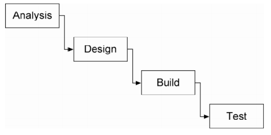
>    
Picture 1.1.1 The waterfall approach

>
> 1.1.2 Models and Notations in Predictive Approaches  
> - 3 forms of models:
>   1. Entity-Relationship diagrams (ER)
>   2. DataFlow Diagrams (DFDs)
>   3. Flow charts
> - Fowler(2000), "Iterative development makes sense in predictable processes as well but it is essential in adaptive processes because they must be able to deal with changes in required features."

### 1.2 Object-Oriented Systems Design

> 1.2.1 Thinking in Objects
> - Important terms to object orientation:
>   1. Class and object
>   2. Encapsulation of data and methods
>   3. Support for polymorphism
>   4. Inheritance within class hierachies
>   5. Object Interface
>
> - Characteristics of Object:
>
> | Object Characteristic | Explanation |
> | :-------------------- | :---------- |
> | State | Each object has properties that collectively represent the state. A state can have dynamic values or permanent values. Example dynamic state: __total money, number of can drink,__ etc. Example permanent state: __name, birth date,__ etc. States are represented by attributes. |
> | Behaviour | It's an object response when the object receive a message. There are probably two types of actions that occur which change the state of the object that receives the message or the state of the object that sends the message. |
> | Identity | It is the property that distinguishes an object from all other objects. Each object has its own unique identity. For example: StudA, StudB, StudC, etc. |
>
> 1.2.2 Unified Process (UP)
> - It is describe as an object-oriented methodology.
> - 4 phases of UP:
>
> | Phase | Purpose |
> | :---- | :------ |
> | Inception | To establish the case for the viability of the purposed system. |
> | Elaboration | The problem domain analysis is made and the architecture of the project gets its basic form. |
> | Construction | Focus on the development of components and other features of the system being designed. Bulk of the coding takes place in this phase. |
> Transition | Product has moved from the development organisation to the end user. Include training to the end user and maintainers and validate it against the end user expectations. |
>
> 1.2.3 Notation
> - Notation is called Unified Modelling Language (UML).  
> 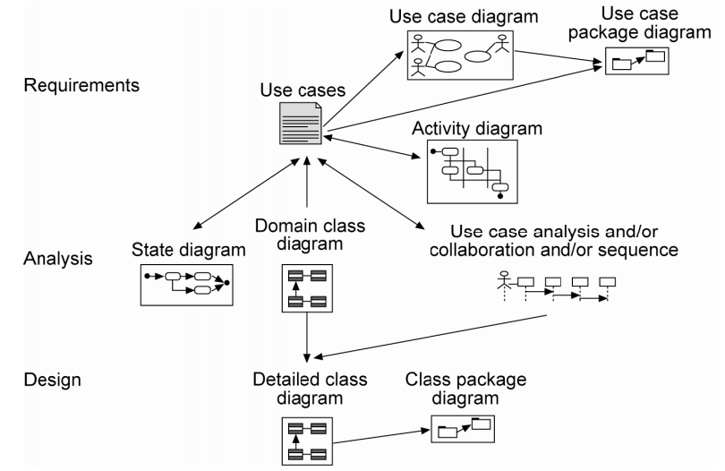  
> 
> - Use of UML notations:
>   1. Use Case
>   2. Domain Model
>   3. Interaction Diagram
>   4. Class Diagram

## Topic 2 Requirement and Use Cases

### 2.1 Requirements Analysis

- Writing the requirements involves:
  1. Defining the purpose of the system
  2. Identifying external interfaces, both human and system-to-system
  3. Identifying major functionality that must be provided by the system
  4. Documenting the requirements
  5. Communicating with users, clients, business analysis and developers so that the system that is developed meets the clients expectations.

> 2.1.1 Levels and Types of Requirements
> - Levels of requirements for the develop system:
>   1. Business requirements - Define the high-level processes that occur in an organization. For example, purpose, objectives, etc.
>   2. System requirements - What the system must do for its users. For example, functional requirements of the system.
>   3. Internal requirements - Relate to technology, personnel, hardware platform requirements. For example, non-functional requirements.
>
> 2.1.2 Challenges of Writing Requirements
> - Possible challenges of writing requirements:
>   1. Problem Domain Complexity
>   2. Person-to-person Communication
>   3. Constant Change
>   4. Writing Requirements in UP

### 2.2 Stakeholders, Actors and Roles

> 2.2.1 Types of Roles
> - Three kinds of roles or actors:
>   1. __Primary__ - a person that directly use the system to enter, view process or extract information.
>   2. __Secondary__ - Person that does not directly use the system, but use or generate data for the system.
>   3. __External__ - Any system that receives or generates data for the system. For example, tax office systems, banks, accounts systems, etc.
>
> 2.2.2 Differences in Roles
> - Questions that need to ask of a person in a role:
>   1. Do they know how to use a computer?
>   2. Do they understand the domain?
>   3. Will they receive any training in using the new system?
>   4. What is their work environment?
>   5. Frequency of use.
>   6. In the course of their work do they refer to paper forms or other data sources?
>   7. Ask about the rank of the following statements: reliability, correctness, satisfaction, ease of use.
>
> 2.2.3 Discovering the Roles
> - Simple ways to start discovering the roles for a system:
>   1. Brainstorm an Initial List (simply write down the names you can think of.)
>   2. Look at Existing Job Titles

### 2.3 Writing Use Cases

> 2.3.1 Goals ang Levels of Use Cases
> - Steps to define use cases:
>   1. define the right system boundary
>   2. identify the primary actors
>   3. identify the actors goals
>   4. define and name the use cases
>
> 2.3.2 Format for Writing Use Cases
> - Types of Use Cases format:
>   1. __Brief use case__ - one-paragraph summary and normmaly used for main success scenario
>   2. __Casual use case__ - an informal paragraph which has multiple paragraphs that cover various scenarios
>   3. __Fully dresses use case__ - It shows all the steps and variations with supporting sections, such as preconditions and success guarantees.
>
> 2.3.3 Use Case Diagrams
> - Simple use case diagram notation:  
> 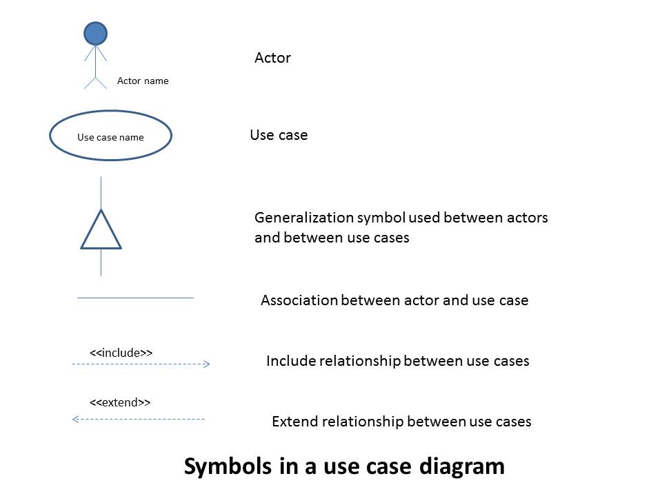
>
> 2.3.4 Activity Diagrams
> - Activity diagram notation:  
> 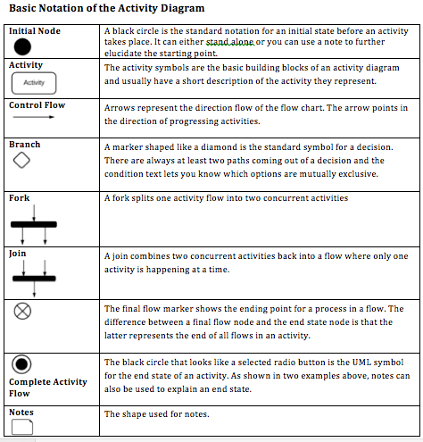
> 
> - Example of activity diagram:  
> 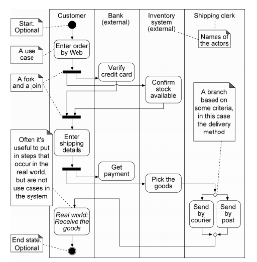
>
> 2.3.5 Potential Problems with Use Cases
> - Pitfalls to be avoided (Lilly 1999):
>   1. The system boundary is undefined or inconstant
>   2. The use case are written from the system's point of view
>   3. The actor names are inconsistent
>   4. Too many use cases
>   5. The actor-to-use case relationship resemble a spider's web
>   6. Specifications are too long
>   7. Specifications are confusing
>   8. Doesn't correctly describe functional entitlement
>   9. Customer does not understand the use cases
>   10. Use cases never finished
> - Advises (Lilly 1999):
>   1. Explicitly define the system's boundary
>   2. Make use of a standardised template for documenting use-case specifications
>   3. When writing use cases, focus on the goals of the actors
>   4. Do not make use-case specification synonymous with user-interface design
>
> 2.3.6 How to Deal with Hundreds of Use Cases
> - Organise the use cases in groups or packages.
> - Possibilities for packaging the use cases:
>   1. by functional areas
>   2. by actor
>   3. by "style" of use case
>   4. by importance or iteration
>   5. by physical implementation
> - Example of use case package:  
> 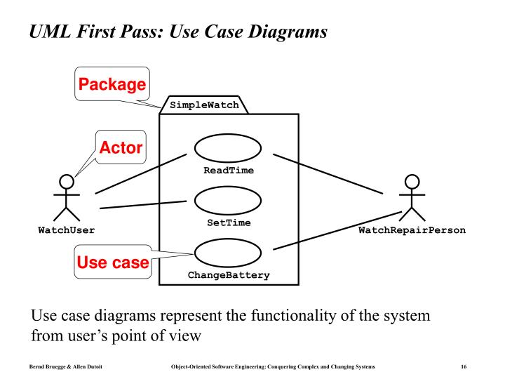

## Topic 3 Object-Oriented Modelling

### 3.1 From Inception to Elaboration

- Outcome of the inception phase:
  1. Vision document - a general vision of the project's requirements. key features, and main constraints
  2. Initial use case model
  3. Initial project glossary
  4. Initial business case, which includes business context, success criteria and financial forecast
  5. Initial risk assessment
  6. Project plan showing phases and iterations
  7. Business model
  8. One or several simple prototypes

- Outcome of the elaboration phase:
  1. Use case model: all use cases and actors have been identified, and most use case descriptions have been developed
  2. Supplementary reequirements
  3. System sequence diagrams that describe the events and their order
  4. Domain model: a visualisation of things in the domain of interest
  5. Design model: a set of diagrams that describe the logical design of the sistem
  6. Software architecture document: summary the key architectural issues and their resolution in the design
  7. Data model: includes the database schema and the mapping strategies between object and non-object representations
  8. Test model: describe what will be tested
  9. Executable architectural prototype
  10. Revised risk list and a revised business case
  11. Development plan for the overall project
  12. Updated development case specifying the process to be used
  13. Preliminary user manual

### 3.2 Use Case Review - System Sequence Diagrams

- Example Sequence Diagram:  
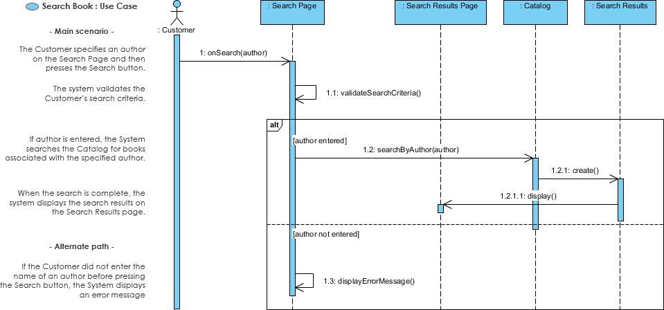

### 3.3 Domain Model

- In domain model, there are three types of information:
  1. __Domain object__ - which identifies a business entity or concept
  2. __Associations between domain objects__ - which define relavant relationships, those that capture business information that needs to be preserved and their multiplicity
  3. __Domain object attributes__ - which are logical data values of an object

- Example of domain model diagram:  

### 3.4 Conceptual Classes

- Three kinds of conceptual classes that will encounter in business modelling:
  1. __Concrete objects__ - tangible object and have a physical presence
  2. __Conceptual objects__ - tangible object and often far more difficult to understand
  3. __Event and state objects__ - object that are related in that typically when an event of any significance occurs, some or more objects will switch to a different state.

- Conceptual class may be considered in the following terms (Larman,2002):
  1. __Symbol__ - words or images that represents a conceptual class
  2. __Intension__ - the definition of a conceptual class
  3. __Extension__ - the set of examples to which the conceptual class applies

### 3.5 Associations

- In UML, association is a relationship expressing the interaction between instances of two conceptuap classes, represented by the verb that describes what they do to each other, and/or by the nouns for the roles that each play in the life of the other.
- Example of relationship between two conceptual classes "Person" and "Magazine":  

> 3.5.1 Identifying Associations
> - Simple method for association identification is, in essence, an exhaustive searching method that will check all the possible relationships between class pairs.
> - Example of UML domain model relation notation:  
> 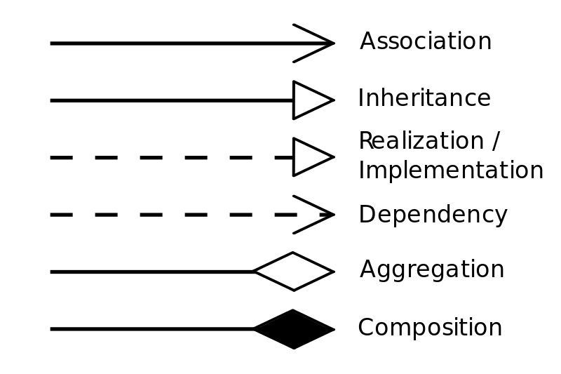
>
> - Example of UML relation association:  
> 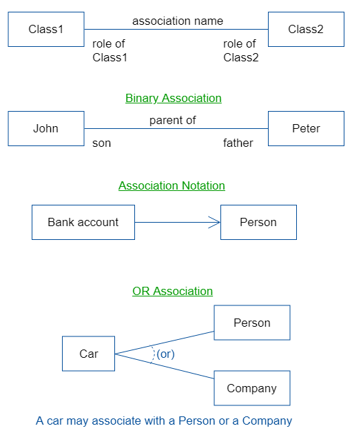
>
> 3.5.2 Multiplicity
> - Multiplicity of an association is the number of instances of each class that can participate in an occurence of the association.
> - The following table lists some possible multiplicity values for association:
>
>   | Multiplicities | Meaning |
>   | :------------: | :------ |
>   | 1 1 | one-to-one |
>   | 1 * | one-to-many |
>   | 1 1..* | one-to-one or more |
>   | 1 0,1 | one-to-zero or one-to-one |
>
> - Example domain model with multiplicity added:  
> 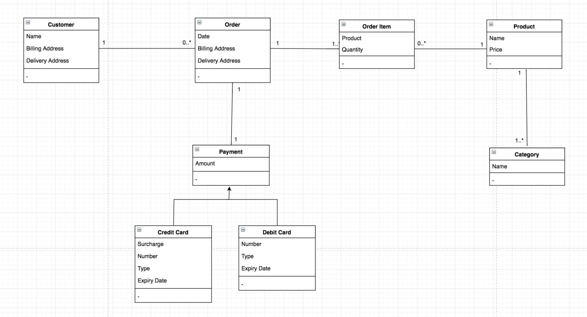
>
> - 3.5.3 Other issues of Association
>   1. __Naming Convention for Associations__
>   2. __Multiple Associations between Two Classes__
>   3. __Associations and Implementation__
>   4. __"Need-to-know" vs Comprehensive Associations__

### 3.6 Attributes

- Attributes are the pieces of data we use to identify or describe things,
- Attributes usually simple data types or primitive data types such as integer, float, string, date, time, etc.
- Below is the example of UML diagram with attributes:  
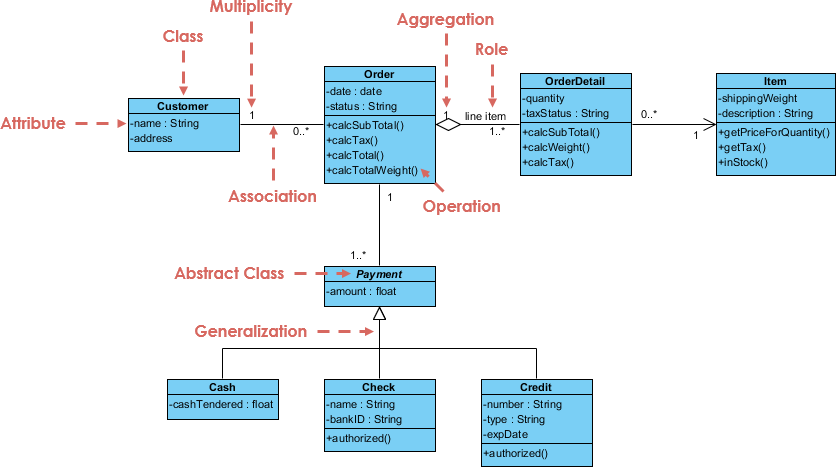

## Topic 4 More Use-Cases

### 4.1 Relating Use Cases

- There are three kinds of relationships between use cases:
  1. __Include__ - a set of use cases each includes some common functionality that is expresed in one share sub-use case
     - Example of "include" relationship use case:  
     
  2. __Extend__ - functionality of a use case is extended by referencing other use cases
     - Example of "extend" relationship use case:  
     
  3. __Generalise__ - several use cases share something similar
     - Example of "generalisaiton" relationship use case:  
     

### 4.2 Finding All Use Cases

- There are two techniques that are very useful to work with the conceptual class model:
  1. draw state diagram for the major conceptual classes
  2. check use case to create, read, update and delete information for every conceptual class

> 4.2.1 State Diagrams 
> - State diagram shows the life cycle of an object: what events it experiences, its transitions and the states it is in between these events.
> - The state diagram provide a basic notation that can be used for a variety of purposes.
> - Example of student subject enrollment state diagrams:  
>   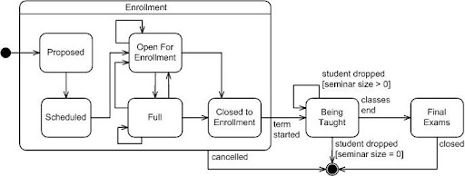
>
> 4.2.2 Create + Read + Update + Delete = CRUD
> - CRUD is used to examine every class in the conceptual class diagram to ensure that either we have all of these operations, or we can decide not to include them.

### 4.3 Business Rules

- Business rules are the most basic part of requiremeny analysis and should be done concurrently with the use case modelling.
- There are some suggestion can best express business rules:
  1. list all the rules in one list, and then refer to the list from everywhere else - use cases, screen mockups, class diagrams, etc.
  2. simply locate the rules in the use cases
  3. keep the use cases simple, but add a section to the use case template to explicity refer to the business rules that each use case implements

### 4.4 More Modelling

> 4.4.1 Robustness Diagram
> - Robustness diagrams are not part of format UML and most CASE tools do not support them.
> - It help us to quickly identify design classes and methods.
> - Quicker than sequence diagram.
> - Three objects that can be classified in use case:
>   1. __Boundary__ - represent all connections between the internal objects of the system and the outside world.
>   2. __Entity__ - the objects that represent data that have to be remembered by the system, either on a more permanent basis beyong the execution of the use case or for the execution of a use case.
>   3. __Controller__ - represent anything else we find that we need to make the whole diagram make sense.
> - Rules to take note during drawing robustness diagram:
>   1. Actors only talk to boundary objects  
>   2. Boundary objects only talk to controller objects  
>   3. Controller objects talk to boundary objects, entity objects or other controllers  
>   4. Entity objects talk only to controllers
> - Symbols used for robustness diagram:  
> 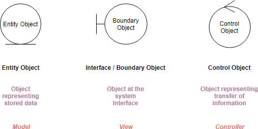
> 
> - Example of robustness diagram:  
> 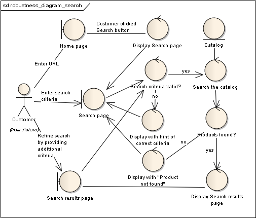

## Topic 5 Dynamic Modelling

### 5.1 The Design Model

- In the design model, two sets of diagrams will produced:
  1. __Design class diagram__ - which defines classes and the relationship between them. It represents the static aspect of the design model
  2. __Interaction diagrams__ - which define class or object interactions. They represent the dynamic aspect of the design model. There are two types of interaction diagrams, __(i). sequence diagram, (ii). collaboration diagrams__.
- The following steps outline how to identify the first cut of software classes for the design model:
  1. Use the requirement model, use cases or domain model and find the nouns. These will most likely be classes
  2. Use the technique of robustness analysis to identify additional classes
  3. Suggest responsibilities
  4. Identify attributes
  5. Identify operations

> 5.1.1 Classes versus objects
> - Class is drawn as a rectangle with three compartments:
>   1. __class name__ - a textual string. For example, "Customer". All classes are singular nouns starting with a capital letter
>   2. __attributes__ - attribute has a name and type seperated by " : "
>   3. __operations__ - behaviour of a class or object that acts upon the attributes in the class or object. Consists of input(in), output(out) and input/output(inout) arguments
> - Example of a class notation:  
>  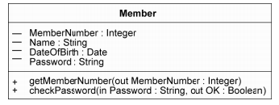
>
> 5.1.2 Objects and Messages
> - Objects communicate with each other by sending and receiving messages.
> - For example: An office worker returns to their desk after the lunch break and her coworker says to her, "While you were out I answered your phone - Please ring Jason Yip on 63433472." = UML format: RingPerson("Jason Yip", "63433472").

### 5.2 Interaction Diagrams

- Interaction diagrams are used to define the class or object interactins within the system.
- Two types of interaction diagrams:
  1. __Collaboration diagrams__
  2. __Sequence diagrams__

> 5.2.1 Collaboration Diagram Notation
> - Diagram contains the following elements:
>   1. Classes - represent the objects involved in the interaction
>   2. Association roles - represent roles that links may play within the interaction
>   3. Messages - labelled arrows, to represent messages sent between objects
> - A collaboration diagram notation:  
> 
>
> - Example of a collaboration diagram:  
> 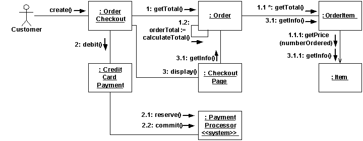
>
> 5.2.2 Sequence Diagram Notation
> - Describe an interaction among elements of a system organised in time sequence.
> - Diagram contains the following elements:
>   1. Classes - represent roles that objects may play within the interaction
>   2. Lifelines - represent the existence of an object over a period of time
>   3. Activations - represent the time during which an object is performing an operation
>   4. Messages - labelled horizontal arrows between lifelines, represent communication between objects
> - A sequence diagram notation:  
> 
>
> - Example of a sequence diagram:  
> 

### 5.3 Design Class Diagram

- The diagram describes classes that will exist in software.
- More details of classes that need to be worked on drawing class diagram:
  1. Visibility
     - __public visibility__ - UML symbol " + "
     - __protected visibility__ - UML symbol " # "
     - __private visibility__ - UML symbol " - "
  2. Full Attribute Specification
     - format of an attribute specification:
       - __\[visibility]name\[:type][=initial value]__
  3. Association
     - association with one-way navigation
     - multiplicity of association between classes
  4. Composition Relationship ("Uses a")
  5. Aggregation Relationship ("Has a")

- Class diagram notation:  
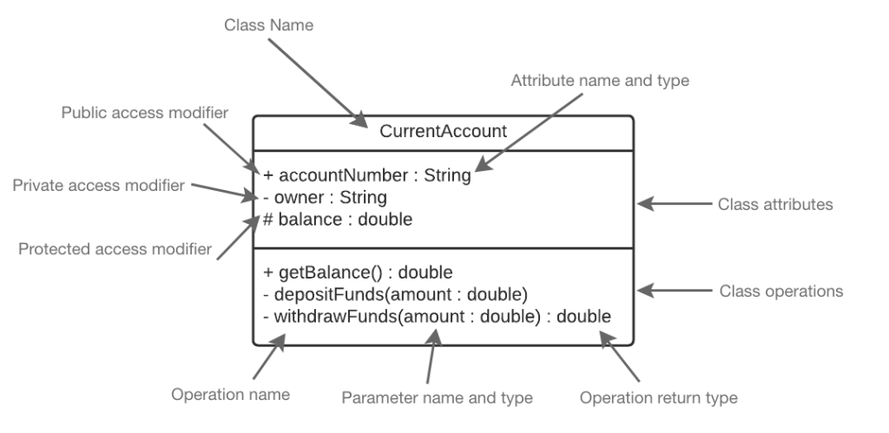

### 5.4 Inheritance

> 5.4.1 Polymorphism
> - Example of simple polymorphism diagram:  
> 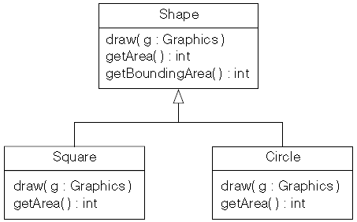  
> 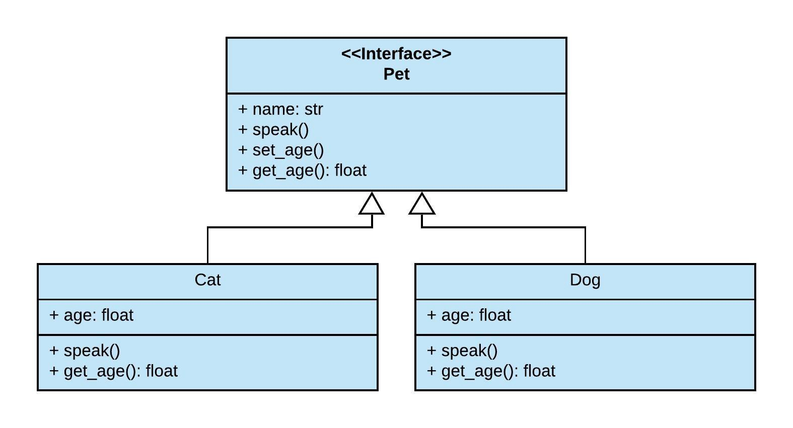
> 
> 5.4.2 Concrete and Abstract Classes
> - Point to take note during drawing concrete and abstract class:
>   1. concrete classes should always be the leaves
>   2. abstract classes should not inherit from concrete classes
> - Examples of simple abstract and concrete class:  
> 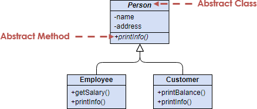  
> 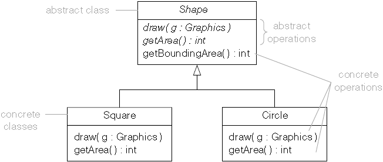

### 5.5 Design Principles

> 5.5.1 Coupling
> - Coupling represents the strength of association between two classes.
> - Types of coupling:
>   1. Identify coupling - measures the level of connectivity of a design
>   2. Representational coupling - measures of how one object accesses the data of another object
>   3. Subclass coupling - occur when a client class directly references a subclass rather than its superclass
>   4. Inheritance coupling - a subclass is related to its superclass by inheritance coupling
>
> 5.5.2 Cohesion
> - It is a measure of how focused the functionality of a class is.

- Examples of Library Management System Class Diagram:  
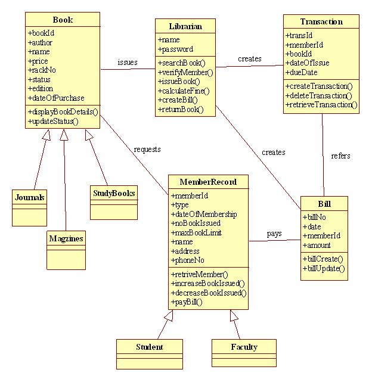
- Class diagram with detailed label on associations:  
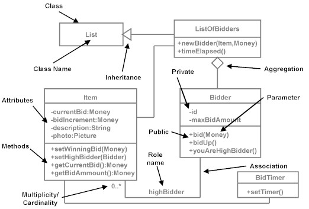
- Class diagram of Customer Order System:  
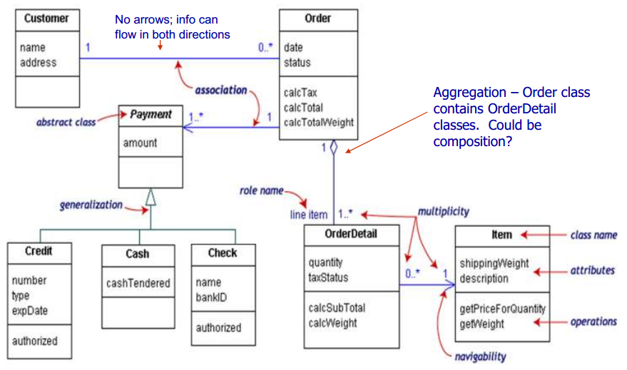
- Detailed class diagram(includes attributes, operations and associations):  

- Class diagram of Book Searching System:  

