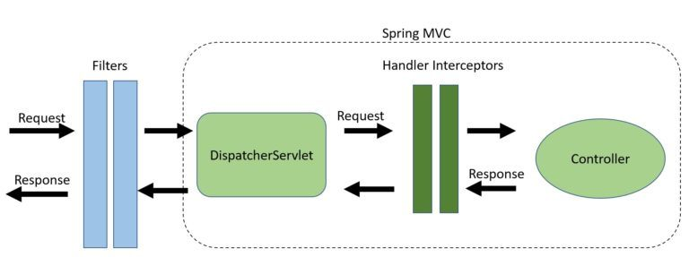

# Java Servlet Filters and Spring Interceptors

## Use cases of Filters and Interceptors

1. Filters
- Can be used within Spring MVC or Java Servlet project
- Authentication
- Loggin and auditing
- Image and data compression
- Any functionality we want to be decoepled from Spring MVC

2. Interceptors
- Can only be done within Spring MVC framework
- Handling cross-cutting concersn such as application logging
- Detailed authorization checks
- Manupulating the Spring context or model

Source: [HandlerInterceptors vs. Filters in Spring MVC, baeldung(Nov, 2022)](https://www.baeldung.com/spring-mvc-handlerinterceptor-vs-filter/)


## Java servlet Filters in Spring boot application

#### Method 1: Declare servlet filter with @Configuration annotation

1. Declare servlet filter
```java
public class Filter1 implements Filter {
  private Logger log = LoggerFactory.getLogger(Filter1.class);

  @Override
  public void init(FilterConfig filterConfig) throws ServletException {
    log.info("Filter initialized at: " + new Date());
    Filter.super.init(filterConfig);
  }

  @Override
  public void doFilter(ServletRequest request, ServletResponse response, filterChain chain) throws IOException, ServletException {
    log.info("Before filter....");
    chain.doFilter(request, response);
    log.info("After filter....");
  }

  @Override
  public void destroy() {
    log.info("Filter destroyed at: " + new Date());
    Filter.super.destroy();
  }
}
```

2. Register filter with @Bean annotation and configure filter bean into Spring project with @Configuration annotation. 
```java
@Configuration
public class FilterConfig {

  @Bean
  public FilterRegistrationBean<Filter1> registerFilter1() {
    FilterRegistrationBean<Filter1> registrationBean = new FilterRegistrationBean<>();
    registrationBean.setFilter(new Filter1());
    registrationBean.addUrlPatterns("/*");
    registrationBean.setName("filter1");
    registrationBean.setOrder(1);

    return registrationBean;
  }
}
```

#### Method 2: Declare servlet filter with @ServletComponentScan annotation

1. Register filter with @WebFilter annotation
```java
@WebFilter(filterName="filter1", urlPatterns={"/*"})
@Order(1)
public class Filter1 implements Filter {
  private Logger log = LoggerFactory.getLogger(Filter1.class);

  @Override
  public void init(FilterConfig filterConfig) throws ServletException {
    log.info("Filter initialized at: " + new Date());
    Filter.super.init(filterConfig);
  }

  @Override
  public void doFilter(ServletRequest request, ServletResponse response, filterChain chain) throws IOException, ServletException {
    log.info("Before filter....");
    chain.doFilter(request, response);
    log.info("After filter....");
  }

  @Override
  public void destroy() {
    log.info("Filter destroyed at: " + new Date());
    Filter.super.destroy();
  }
}
```

2. Adding @ServletComponentScan at Spring boot main application class
```java
@SpringBootApplication
@ServletComponentScan
public class MainApplication {
  public static void main(String[] args) {
    SpringApplication.run(MainApplication.class, args);
  }
}
```

## Spring Interceptor
1. Create Interceptor with @Component annotation:
```java
@Component
public class MyInterceptor implements HandlerInterceptor {
  private Logger log = LoggerFactory.getLogger(MyInterceptor.class);

  @Override
	public boolean preHandle(HttpServletRequest request, HttpServletResponse response, Object handler) throws Exception {
		log.info("Request has passed into interceptor.");
		return true;
	}
	
	@Override
	public void postHandle(HttpServletRequest request, HttpServletResponse response, Object handler, ModelAndView modelAndView) throws Exception {
		log.info("Request after pre handle.");
		HandlerInterceptor.super.postHandle(request, response, handler, modelAndView);
	}

	@Override
	public void afterCompletion(HttpServletRequest request, HttpServletResponse response, Object handler, Exception ex) throws Exception {
		log.info("Request after post handle.");
		HandlerInterceptor.super.afterCompletion(request, response, handler, ex);
	}
}
```

2. Register interceptors into Spring boot project
```java
@Configuration
public class InterceptorConfig implements MebMvcConfigurer {
  @Autowired
  private MyInterceptor myInterceptor;

  @Override
  public void addInterceptors(InterceptorRegistry registry) {
    registry.addInterceptor(myInterceptor)
            .addPathPatterns("/**")
            .excludePathPatterns("/**/login");
  }
}
```
