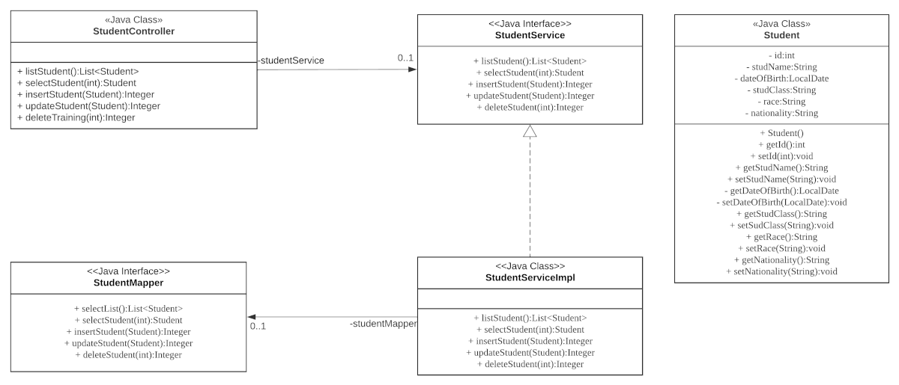

# Simple CRUD student management system with Spring Boot, MyBatis

A simple student management system which developed for educational purpose. The system develop with MVC design pattern. The developed management system comes with the simple SQL operations such as <strong>Create+Read+Update+Delete</strong> that used to manage the database data. 

### Tools & Frameworks needed:
| Details | Tools/Framework |
| :------: | :-------------: |
| Back-end | Spring Boot |
| Database | MySQL |
| Mapping framework | MyBatis |
| Front-end | Thymeleaf |

### Class diagram for Student
